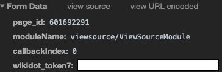

The access token is used to make requests in your account's behalf, and it is necessary to get the app working.

# Getting an access token

1. Go on [the SCP Wiki](http://www.scp-wiki.net/) (or any other wikidot website).
2. Right-click on anything, and select *Inspect Element*.
3. On the new pane that should've opened up, click the tab *Network*, and then on the tab *XHR*.
4. Refresh the page.
5. Click the *ajax-module-connector.php* row that should've appeared.
6. In the tab *Headers*, scroll down until you find the section *Form Data*.
7. Copy the value of the `wikidot_token7` row.


**WARNING: DO NOT SHARE YOUR TOKEN WITH ANYONE**. Do not post your access token anywhere.

# Using your access token

To prevent you from sharing your access token, here's a way you can use it while hidden.

First, write a `config.py` file with your access token.

```python
TOKEN = "YOUR-ACCESS-TOKEN"
```

Then you can import it from your application.

```python
from scpython import Client
from path.to.config import TOKEN

conn = scpython.Client(TOKEN)
# Code...
```

If your project is a git repo, write the following to your `.gitignore`:
```
# The file will be ignored by git
path/to/config.py
```