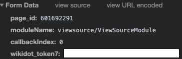

Access Token
============

To use this package, you must first get your account's **access token**.
Below are some simple instructions to get yours.

Getting an access token
-----------------------

1. Go on the `SCP Wiki <http://www.scp-wiki.net/>`_.
2. Right-click on anything, and select *Inspect Element*.
3. On the new pane that should've opened up, click the tab *Network*, and then on the tab *XHR*.
4. Refresh the page.
5. Click the *ajax-module-connector.php* row that should've appeared.
6. In the tab *Headers*, scroll down until you find the section *Form Data*.
7. Copy the value of the ``wikidot_token7`` row.

.. warning::
    Do not share your token with anyone.
    Do not post your access token anywhere.
    **If someone knows your token, it's like if they knew your username and password.**

Using your access token
-----------------------

To prevent you from sharing your access token, here's a way you can use it while hidden.

First, write a ``config.py`` file with this single line::

    TOKEN = "YOUR-ACCESS-TOKEN"

Then you can import it from your application::

    from scpython import Client
    from path.to.config import TOKEN

    conn = Client(TOKEN)
    # Code...

If your project is a git repo, write the following to your ``.gitignore``::

    # The file will be ignored by git
    path/to/config.py
